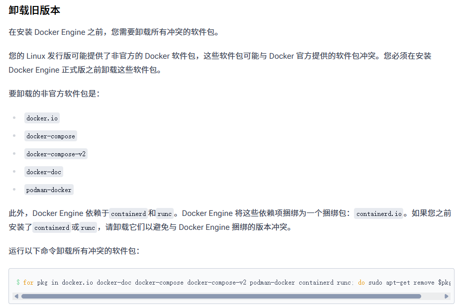

## Ubuntu24.03安装docker

> 参考[dockerdocs官方文档](https://docs.docker.com/engine/install/ubuntu/)
>
> 官方文档里面对各个方面讲解的非常清晰，跟着文档步骤操作很容易实现！

### 如何卸载Docker

> 安装应用先学会卸载应用！！！

1. 卸载 Docker Engine、CLI、containerd 和 Docker Compose 软件包：

   ```bash
    sudo apt-get purge docker-ce docker-ce-cli containerd.io docker-buildx-plugin docker-compose-plugin docker-ce-rootless-extras
   ```

2. 主机上的镜像、容器、卷或自定义配置文件不会自动删除。要删除所有镜像、容器和卷，请执行以下操作：

   ```bash
    sudo rm -rf /var/lib/docker
    sudo rm -rf /var/lib/containerd
   ```

3. 删除源列表和密钥环

   ```bash
   sudo rm /etc/apt/sources.list.d/docker.list
   sudo rm /etc/apt/keyrings/docker.asc
   ```

### 检查安装前的环境



```bash
for pkg in docker.io docker-doc docker-compose docker-compose-v2 podman-docker containerd runc; do sudo apt-get remove $pkg; done
```

> 卸载 Docker 时，存储在 Docker 中的镜像、容器、卷和网络`/var/lib/docker/`不会自动删除。

### 使用apt存储库安装

在新的主机上首次安装 Docker Engine 之前，您需要设置 Docker`apt`仓库。之后，您可以从该仓库安装和更新 Docker。

1. 设置 Docker 的`apt`存储库。

   ```bash
   # Add Docker's official GPG key:
   sudo apt-get update
   sudo apt-get install ca-certificates curl
   sudo install -m 0755 -d /etc/apt/keyrings
   sudo curl -fsSL https://download.docker.com/linux/ubuntu/gpg -o /etc/apt/keyrings/docker.asc
   sudo chmod a+r /etc/apt/keyrings/docker.asc
   
   # Add the repository to Apt sources:
   echo \
     "deb [arch=$(dpkg --print-architecture) signed-by=/etc/apt/keyrings/docker.asc] https://download.docker.com/linux/ubuntu \
     $(. /etc/os-release && echo "${UBUNTU_CODENAME:-$VERSION_CODENAME}") stable" | \
     sudo tee /etc/apt/sources.list.d/docker.list > /dev/null
   sudo apt-get update
   ```

2. 安装 Docker 包。

   要安装最新版本，请运行：

   ```bash
    sudo apt-get install docker-ce docker-ce-cli containerd.io docker-buildx-plugin docker-compose-plugin
   ```

3. 通过运行镜像验证安装是否成功`hello-world`：

   ```bash
    sudo docker run hello-world
   ```

   此命令下载一个测试镜像并在容器中运行。容器运行时，它会打印一条确认消息并退出。

您现已成功安装并启动 Docker Engine。

> 当然由于网络原因你可能无法获取到官方仓库的镜像，但是可以参考网上的一些修改docker配置，使用国内镜像。(官方文档里面有配置代理的方法)https://docs.docker.com/engine/cli/proxy/   还可以咨询AI，如CHAT-GPT、DeepSeek等。

### 以非root用户管理Docker

1. 创建`docker`群组。

   ```bash
    sudo groupadd docker
   ```

2. 将您的用户添加到`docker`组中。

   ```bash
    sudo usermod -aG docker $USER
   ```

3. 注销并重新登录，以便重新评估您的群组成员资格。

   > 如果您在虚拟机中运行 Linux，则可能需要重新启动虚拟机才能使更改生效。

   您还可以运行以下命令来激活对组的更改：

   ```bash
    newgrp docker
   ```

4. 验证您是否可以`docker`在没有`sudo`的情况下运行命令。

   ```bash
    docker run hello-world
   ```

### 配置 Docker自启动

1. 许多现代 Linux 发行版使用[systemd](https://systemd.io/)来管理系统启动时启动的服务。在 Debian 和 Ubuntu 上，Docker 服务默认在系统启动时启动。对于使用 systemd 的其他 Linux 发行版，要使其在启动时自动启动 Docker 和 containerd，请运行以下命令：

   ```bash
   sudo systemctl enable docker.service
   sudo systemctl enable containerd.service
   ```

2. 要停止此行为，请`disable`改用。

   ```bash
    sudo systemctl disable docker.service
    sudo systemctl disable containerd.service
   ```

