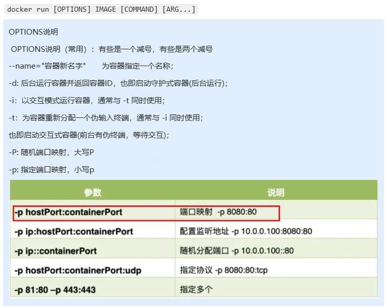

## docker安装MySQL


### 拉取镜像

1. 查看本机存储的镜像

   ```bash
   docker images
   ```

2. 向远程仓库搜索镜像

   ```bash
   docekr search ImageName
   ```

3. 拉取镜像

   ```bash
   docker pull ImageName[:TAG]
   ```

   > :TAG用来选择要拉取的版本

### 容器启动设置

**docker创建容器**



```bash
docker run --name my-mysql \
-e MYSQL_ROOT_PASSWORD=my-secret-pw \
-e MYSQL_DATABASE=mydb \
-v my-db-volume:/var/lib/mysql \
--retart=always \
-d mysql:latest

```

**打开后台运行的容器**

> exec 是在容器中打开新的终端，并且可以启动新的进程 用exit退出，不会导致容器的停止。

```bash
docker exec -it 容器ID /bin/bash
```

**docker挂载主机目录**

> - 在 Docker 主机和容器上的开发环境之间共享源代码或构建工件。
> - 当您想要在容器中创建或生成文件并将文件保存到主机的文件系统中时。
> - 将配置文件从主机共享到容器。

> **如果您使用 `--volume`或者`-v` 绑定挂载 Docker 主机上尚不存在的文件或目录，Docker 会自动在主机上创建该目录。它始终以目录形式创建。**

```bash
docker run --volume <host-path>:<container-path> ImageName
```

> <host-path>  主机的绝对路径目录
>
> 中间是个冒号
>
> <container-path>  容器内目录

> 在ubuntu中先创建MySQL的数据和日志文件的共享文件夹用于挂载容器；

### 配置容器自启动

1. 以下命令启动 MySQL 容器并将其配置为始终重新启动，除非明确停止容器或守护程序重新启动。

   ```bash
   docker run -d --restart=always MySQL
   ```

2. 以下命令更改已运行的名为 `MySQL` 的容器的重启策略。

   ```bash
    docker update --restart=always MySQL
   ```

   