# 小白学网络——应用层

------

想要获取参考书籍可以前往这个链接[CS-Books: 超过1000本的计算机经典书籍](https://github.com/forthespada/CS-Books)

------

## OSI模型和TCP/IP体系

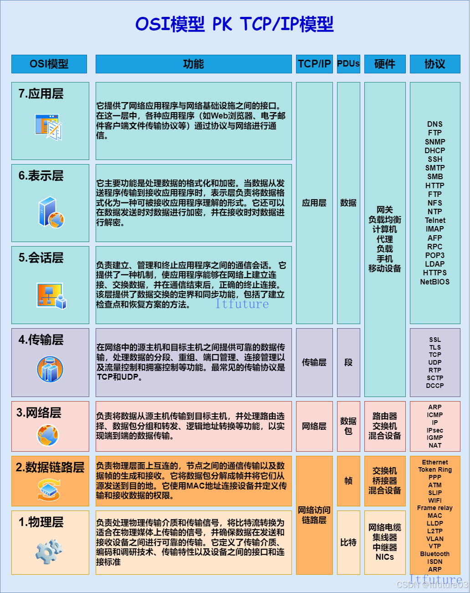

应用层通过使用下面各层所提供的服务，直接向用户提供服务，是计算机网络与用户之间的界面或接口。应用层提供的是服务，而不是提供具体的网络应用软件。

在网络体系结构中，每一层都有一个服务作用实体，应用层的实体就是各种正在运行的用户网络应用进程。每个应用层协议都是为了解决某一类问题,通过位于不同主机的多个应用进程之间的通信和协同工作来完成。应用层的具体内容就是规定应用进程在通信时所遵循的协议,应用层的许多协议都是基于客户服务器方式。

## 协议

网络应用由不同的用户和软件供应商开发而成。为了实现网络应用的功能，在应用之间进行通信时将其连接的网络协议是非常重要的。（应用之间交互的信息叫消息。应用协议定义这些消息的格式以及使用这些消息进行控制或者操作的规则）

设计师和开发人员根据所开发模块的功能和目的，可以利用现有的应用协议，也可以自己定义一个新的应用协议。

应用可以直接享用传输层以下的基础部分，开发者只要关心选择哪种应用协议，如何开发即可，而不用担心应用中的数据该以何种方式发送到目的主机等问题。

## 常用应用层协议

### Web服务与HTTP

Web的应用层协议是超文本传输协议HTTP(Hyper Text Transform Protocol),它是Web的核心。

HTTP定义了Web客户端向Web服务器请求Web页面的方式，以及Web服务器向Web客户端传送Web页面的方式。

Web页面由对象组成，一个对象只是一个文件如一个HTML文件、一个JPEG图片、一个JavaScript文件、一个CSS样式表文件或者视频片段，它们可通过URL寻址。每个URL由两部分组成：存放对象文件的服务器主机名和对象路径名，例如：https://www.w3school.com.cn/html/html_editors.asp,其中https://www.w3school.com.cn就是服务器主机名，/html/html_editors.asp就是对象路径名。

#### URI和URL

URI(Uniform Resource Identifier)统一资源标识符。

URL(Uniform Resource Locator)统一资源定位符。与URI相比，我们更熟悉URL，URL是我们访问Web页面时需要输入的网址。

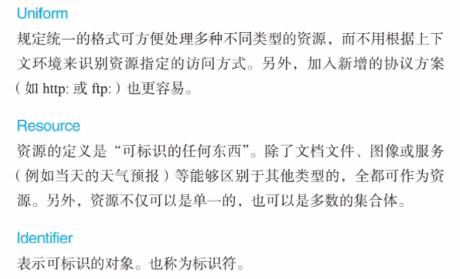

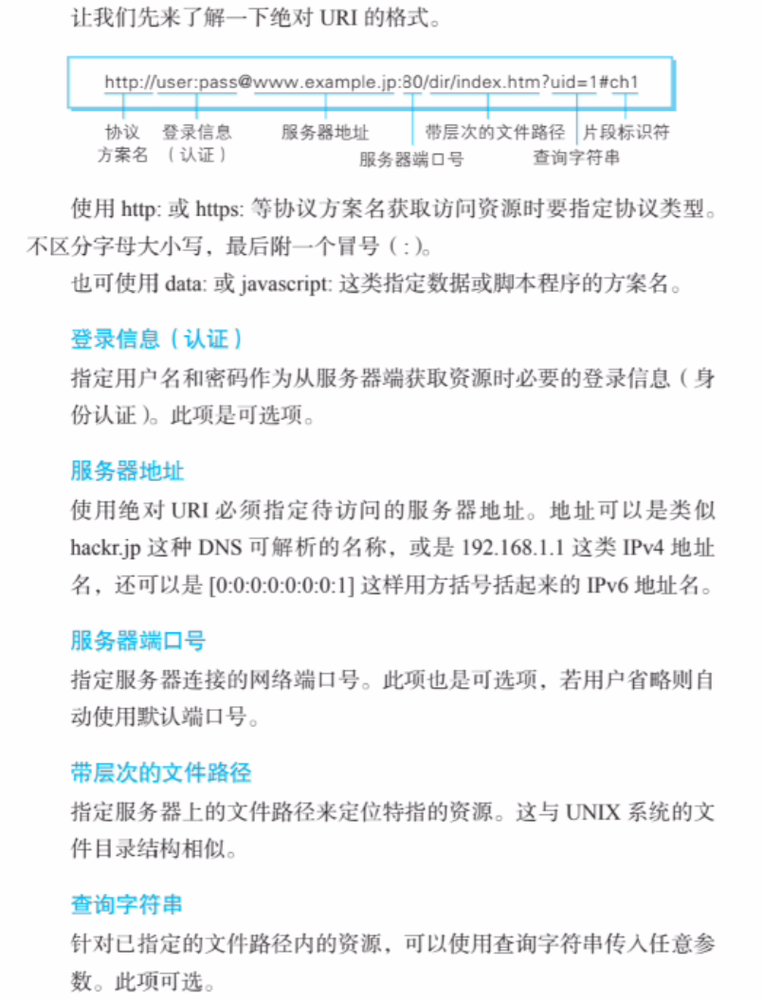

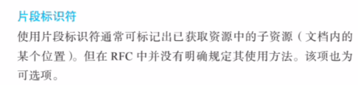

##### 非持续连接和持续连接

非持续连接：经历每一个请求-应答过程后就会关闭所使用的TCP连接，单击新的链接后又会重新建立新的TCP连接。

持续连接：HTTP允许在同一个TCP连接基础上访问同一网站服务器上的多个不同页面，仅当用户关闭对应的网站时，对应的网站TCP传输连接才关闭。HTTP的默认模式是采用带流水线模式的持续连接。

##### HTTP报文格式

可以参考[MDN Web Docs](https://developer.mozilla.org/zh-CN/) 中的文章或查看RFC官方文档

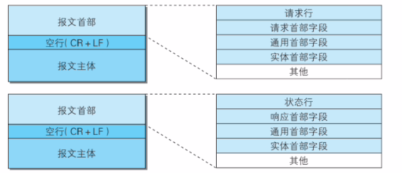

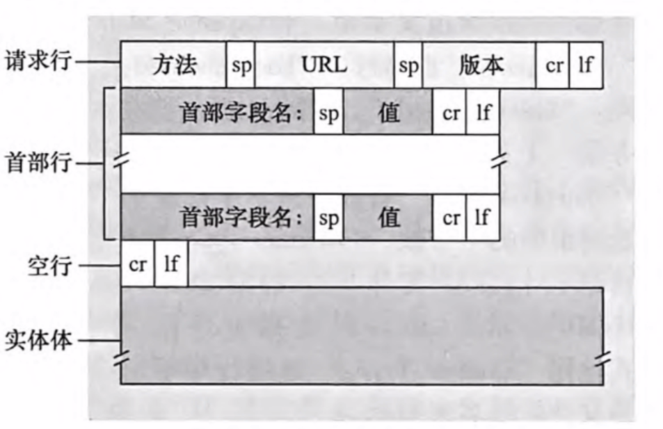

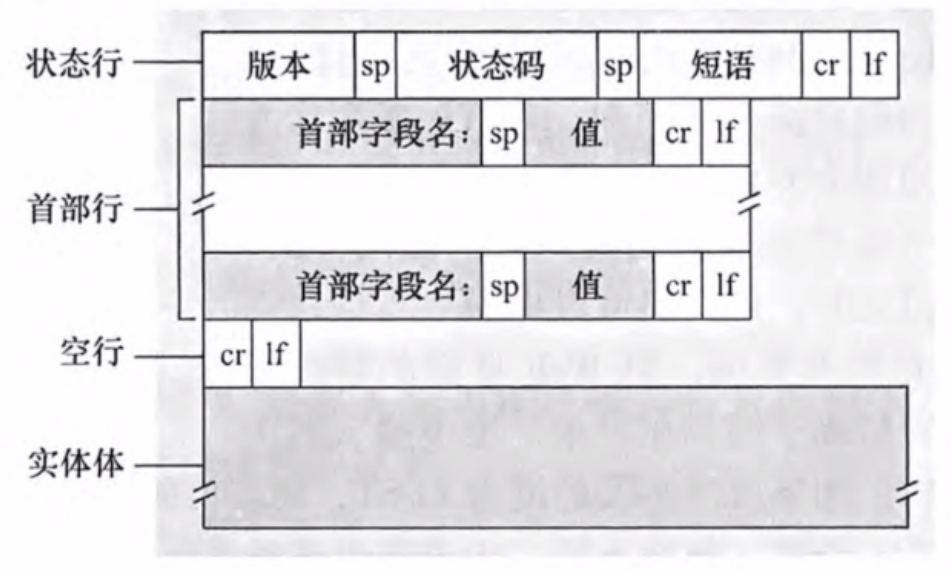

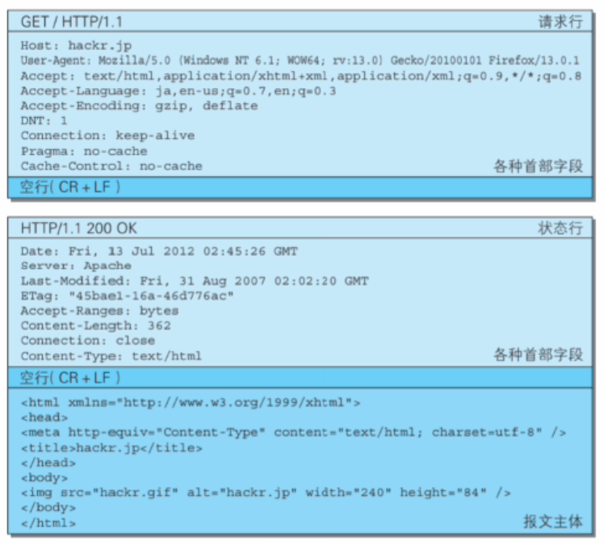

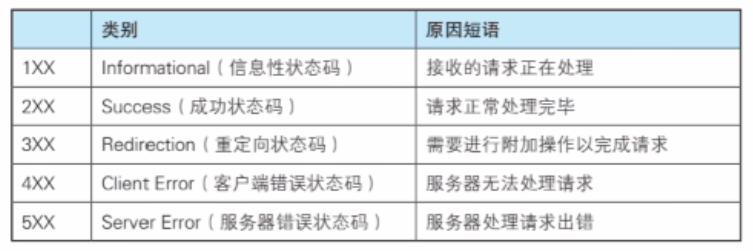

##### 报文首部

HTTP协议的请求和响应报文中必定包含HTTP首部。首部内容为客户端和服务器分别处理请求和响应提供所需要的信息。

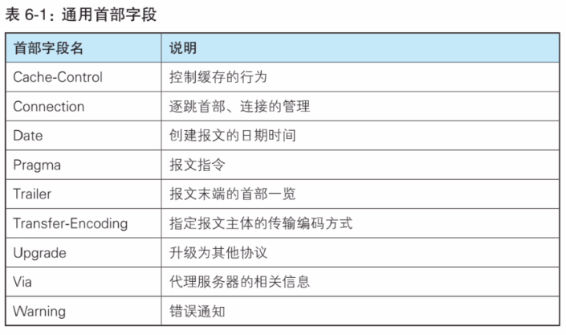

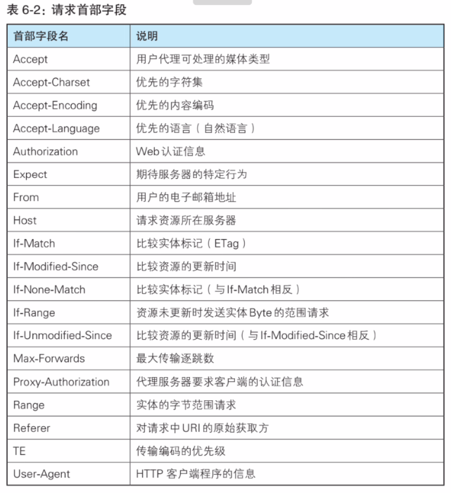

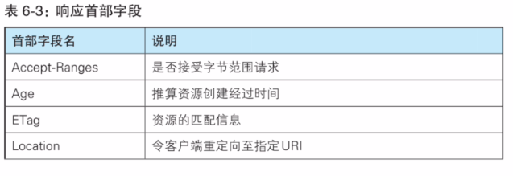

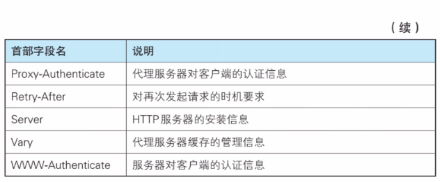

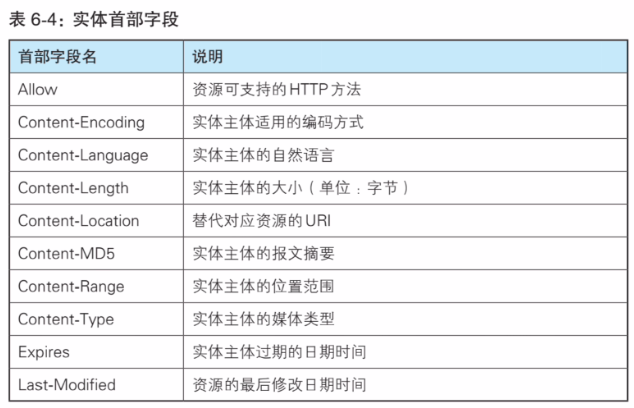

非HTTP/1.1首部字段如：

- Cookie
- Set-Cookie
- Content-Disposition

##### HTTP的特点

- 无状态协议
- 使用请求和响应传输信息

##### 使用Cookie进行状态管理

前面提到HTTP服务器是无状态的，然而一个Web站点希望能够识别用户，或是限制用户访问，或是将内容与用户绑定。为此，HTTP使用Cookie [RFC6265]。

Cookie技术有四个组件：

1. 在HTTP响应报文中的一个cookie首部行
2. 在HTTP请求报文中的一个cookie首部行

### 电子邮件服务

#### SMTP

#### MIME

#### POP

#### IMAP

### DNS域名解析服务

### DHCP

### 远程登录服务

#### Telnet

#### SSH

### FTP(文件传输服务)

### Socket网络编程

#### API调用

#### 简单项目

#### Servlet容器

## 参考文章

1. 《图解HTTP》
2. 《图解TCP/IP》
3. 《计算机网络：自顶向下方法》
4. [《深入理解计算机网络》之应用层总结 - 知乎](https://zhuanlan.zhihu.com/p/473175282)
5. 
